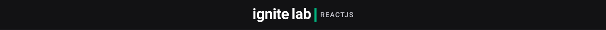
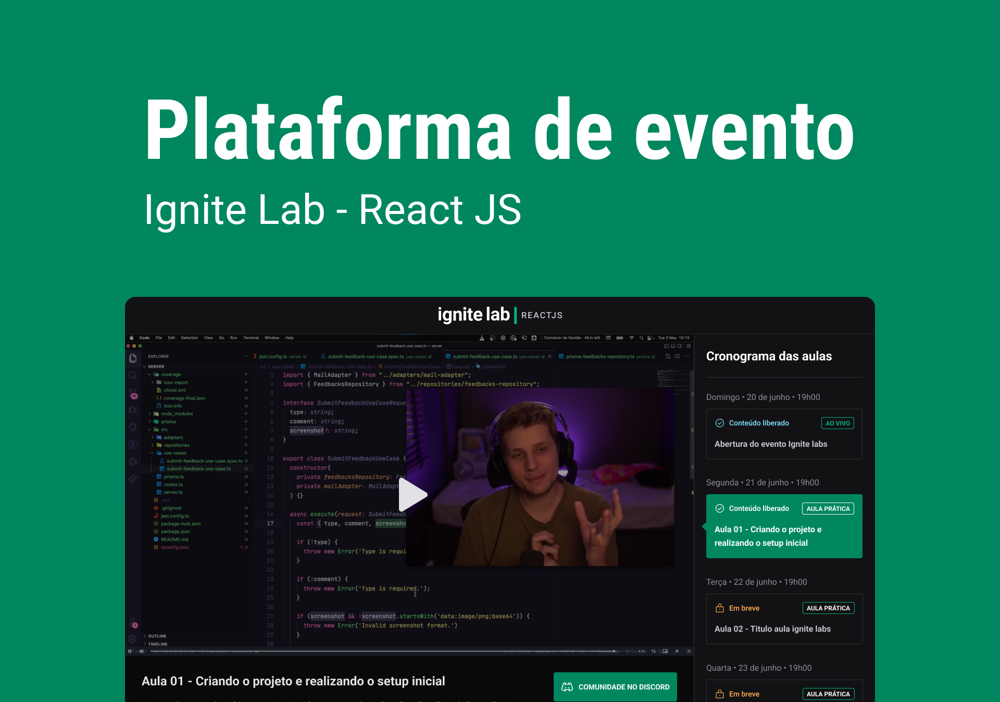

<p align="center">
  <a href="#-tecnologias">Tecnologias</a>&nbsp;&nbsp;&nbsp;|&nbsp;&nbsp;&nbsp;
  <a href="#ℹ-como-usar">Como usar</a>&nbsp;&nbsp;&nbsp;|&nbsp;&nbsp;&nbsp;
  <a href="#-projeto">Projeto</a>&nbsp;&nbsp;&nbsp;|&nbsp;&nbsp;&nbsp;
  <a href="#-sobre">Sobre</a>&nbsp;&nbsp;&nbsp;|&nbsp;&nbsp;&nbsp;
</p>

<br>

<p align="center">
  
</p>

## 🚀 Tecnologias

Esse projeto foi desenvolvido com as seguintes tecnologias:

- [React Js](https://pt-br.reactjs.org/)
- [Tailwindcss](https://tailwindcss.com/)
- [Graphql](https://graphql.org/)
- [GraphCMS](https://app.graphcms.com/)
- [Graphql Code Generator](https://www.graphql-code-generator.com/)
- [TypeScript](https://www.typescriptlang.org/)
- [Vite](https://vitejs.dev/)
- [Apollo](https://www.apollo.io/)
- [Vime](https://vimejs.com/)

## ℹ Como usar

Para clonar e executar este aplicativo, você precisará de [Git](https://git-scm.com) e [Node.js](https://nodejs.org/en/) instalado no seu computador. Da sua linha de comando:

```bash
# Clone o repositório
$ git clone https://github.com/GustavCunha/ignite-lab.git e cd ignite-lab

# Instale as dependências
$ npm install ou yarn

# Execute o aplicativo
$ npm run dev ou yarn dev
```

## 💻 Projeto

O Event Platform é uma plataforma de eventos, que acontecem durante o período de uma semana ou mais. É possível assistir ao vivo ou as gravações do evento.
Layout do Projeto - [Figma](https://www.figma.com/community/file/1120711251998877938)

## 📜 Sobre

Este é um projeto desenvolvido durante o **[Ignite Lab](https://lp.rocketseat.com.br/inscricao/ignite-lab)**, apresentado por **[@Rocketseat](https://github.com/Rocketseat)** de 20 a 26 de junho de 2022. <br/>
Através desse treinamento da Rocketseat, pude aprender novos aspectos do React Js e outras tecnologias, e pretendo utilizá-las em projetos pessoais e profissionais.